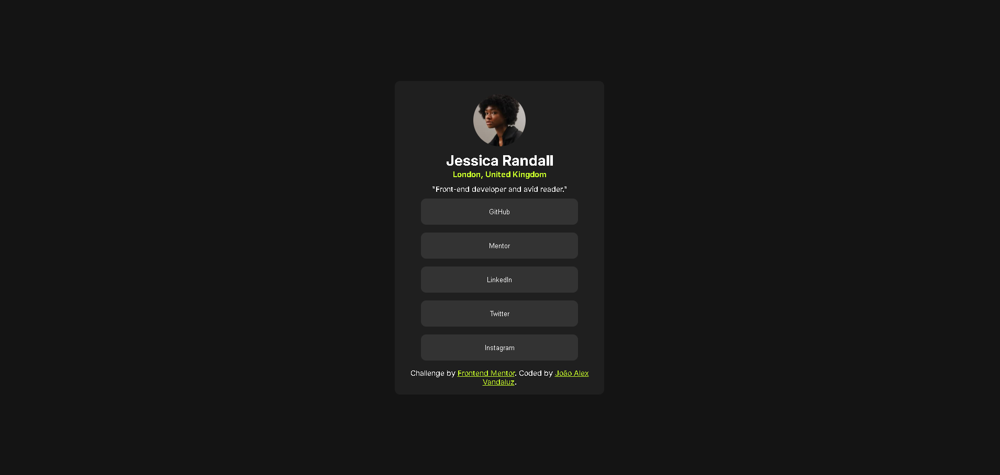

# Social Links Profile

> Projeto Frontend Mentor: página de perfil social com botões de links.



## Descrição

Projeto criado a partir de um desafio do **Frontend Mentor**.  
A página apresenta um perfil fictício (Jessica Randall) com avatar, localização, descrição e botões de redes sociais, utilizando **HTML, CSS moderno e Flexbox** para centralização e layout.

O objetivo é **praticar layout flexível, centralização, variáveis CSS e organização de projeto**.

## Tecnologias

- HTML5  
- CSS3  
- Flexbox  
- CSS Custom Properties (variáveis)  
- Google Fonts (Inter)  

## Funcionalidades

- Layout centralizado vertical e horizontalmente  
- Avatar circular estilizado  
- Botões de links sociais com tamanho uniforme e hover  
- Paleta de cores consistente usando variáveis CSS  
- Fonte personalizada via Google Fonts  
- Estrutura organizada de pastas (`assets`, `style`)

## Como usar

1. Clone o repositório:  
```bash
git clone https://github.com/alexvandaluz/social-links-profile.git
